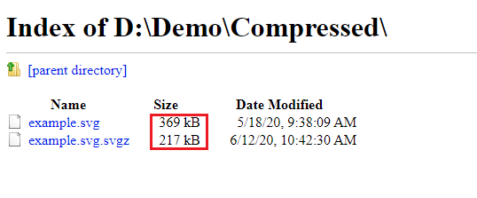
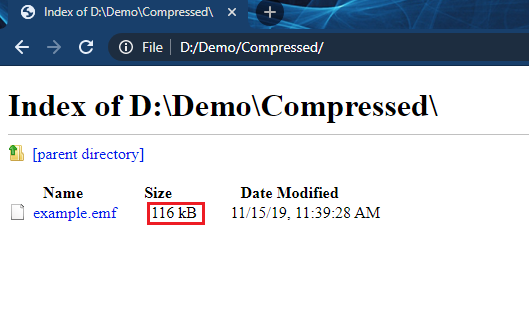
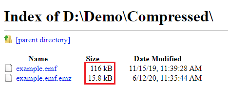
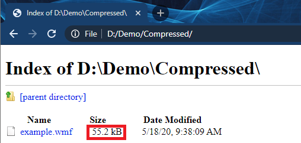
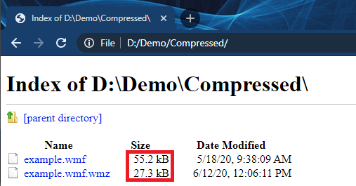
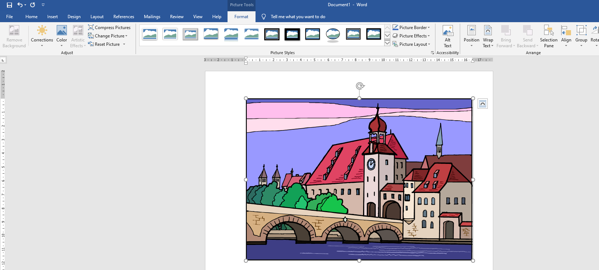

Compressed vector images are vector images of the EMF, WMF, SVG formats compressed using a zip archiver. Their size averages from 30-70% of the original. This saves space on media and reduces file transfer time over the network. But you should pay attention to the fact that not all applications work with compressed vector formats. See below for more details. 
## SVGZ
SVGZ files are typically 50 to 80 percent smaller in size than SVG.

For example, take any SVG file and compress it to SVGZ:

As you can see the size of the source file is **369** kb

**Convert SVG to SVGZ** using the following code:



The resulting file size is  ~**59%** of the original.
We can open this file using any of the above applications.

Using the following code, it is possible to **convert the SVGZ to SVG:**


## EMZ
A file with the EMZ file extension is a  actually just GZIP compressed EMF files, which is a graphics format used by Microsoft (**MS Word, MS Visio**)

For example, take any EMF file and compress it to EMZ:

As you can see the size of the source file is **116** kb
**Convert EMF to EMZ** using the following code:



The resulting file size is  ~**14%** of the original.

Open result emz file in MS Word

Using the following code, it is possible to **convert the EMZ to EMF**


## WMZ
A file with the WMZ file extension is a  actually just GZIP compressed WMF files, which is a graphics format used by Microsoft (**MS Word, MS Visio**).

For example, take any WMF file and compress it to WMZ:

As you can see the size of the source file is **55.2** kb. **Convert WMF to WMZ** using the following code:



The resulting file size is  ~**49%** of the original.

Open result emz file in MS Word

Using the following code, it is possible to **convert the WMZ to WMF:**



