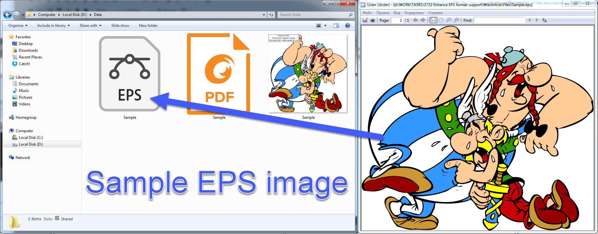
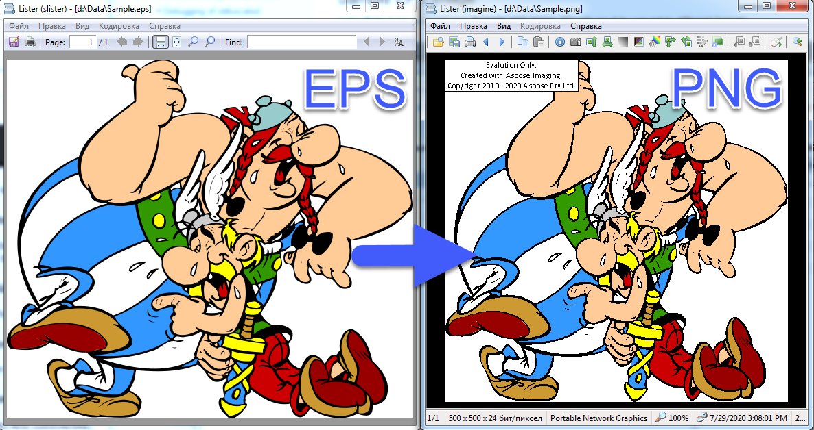
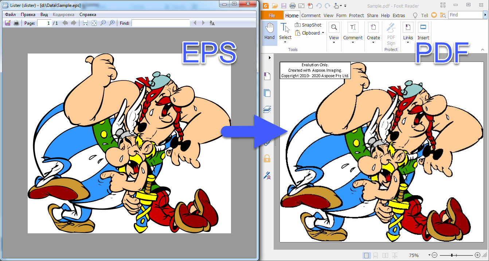

### What is EPS image format?

EPS file format is short for Encapsulated PostScript. It was created by  Adobe back in 1992. It’s a standard graphics file format intended for  placing images or drawings within a PostScript Document. Basically it’s a postscript program saved as a single file. EPS file also includes a  low-resolution preview of the graphics inside which makes it accessible  with programs not capable of editing the script inside. EPS file format  is widely used by publishers because of its compatibility across  different operating systems.

An EPS file can contain any  combination of text, graphics, and images. Since it is actually a  PostScript file, it is one of the most versatile file formats that are  available. The files are supported by several different drawing programs and vector graphic editing applications. Many image converter programs  can create EPS files containing the pixels of the image. An EPS file is a stream of generic PostScript printing commands. Thus many PostScript  printer drivers have an option to save as EPS.

### The image preview

EPS files can optionally contain a bitmapped image preview so that systems  that can’t render PostScript directly can at least display a crude  representation of what the graphic will look like. There are 4 preview  formats: PICT, TIFF, Metafile and EPSI. It is also possible to have an  EPS file without a preview, though. In this case, the imported file is  usually displayed as a grayed out box or a box with diagonal lines  running through it.

The preview image has a fixed resolution,  which is usually 72 dpi. If you enlarge an EPS file in a document, the  preview image is stretched and may become ‘blocky’ and lacking in  detail. This does not necessarily mean that the EPS-data themselves will degrade in quality. As long as the EPS-file only contains text and  vector graphics, scaling it does not affect its quality. If you print a  file containing an EPS-image on a non-PostScript printer, it is usually  the preview image that gets printed. The preview image is ignored when  you print to a PostScript device.

### Sample EPS Image

In the **Data** folder you can see **Sample.eps** image. We will use it to convert to different formats.

### Convert EPS to PNG

The following code converts EPS image to PNG. The property **PreviewToExport** allows to select the source of the image to export from EPS file. The value **PostScriptRendering** of the enumeration **EpsPreviewFormat** cause rendering from PostScript to raster image.



As a result you can see a PNG image rendered using a PostScript from EPS file:

### Convert EPS to PDF

*Aspose.Imaging* library allows you to export EPS image to other formats. For that you  just need to use corresponding Image options. The following code  demonstrates how to export EPS image to PDF:



On the following image you can see created PDF file:

